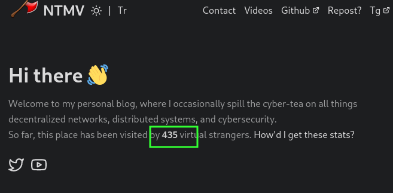

# TVAP for Plausible Analytics
[](https://hub.docker.com/r/xnct/tvap)



TVAP (Total Visitors API Proxy ) is a simple and easy-to-use Plausible total visitors API proxy.
This proxy API provides a convenient and secure way to display visitor count data from Plausible on a static website. It allows developers to easily integrate the functionality without the need to expose their Plausible API key or build a custom implementation.

The API was built using Node.js and the Express framework. It utilizes the request-promise-native library to make API calls to Plausible. Also, it uses the memory-cache library for caching the visitor count data, which can be configured with a custom expiration time.

When a request is made to the API's endpoint, it first checks if the visitor count data is present in cache. If it is, the cached data is returned to the client. If the data is not present in cache, the API makes a request to Plausible's API using the provided API key and site ID. The returned data is then cached and returned to the client.

In addition to the core functionality, the API also includes security features such as helmet and CORS support, as well as request logging. The logs can be written to a file and can be used to track the usage of the API.

## Features

- Caches the visitors data from Plausible API
- Serves the cached data to clients
- Protects API key
- Logs invalid requests
- Supports CORS

## Deployment

### Method 1: Running TVAP with Plausible as an add-on to the existing docker-dompose

If you have a Plausible instance running on your own server, you can run the TVAP script on that same server to achieve low latency. This method involves adding the TVAP service to your existing Plausible Docker Compose file and running both services together. This will reduce the latency and improve the performance of the TVAP script as it communicates directly with the Plausible service. The steps to do this are as follows:

- 1. Stop your existing Plausible Docker Compose.
```
sudo docker-compose dowm
```
- 2. Edit the docker-compose.yml file and add the following code snippet (check demo-docker-compose.yml):
```
app:
    image: xnct/tvap
    environment:
      - SITE_ID=<site_id>
      - KEY=<api_key>
      - BASE=plausible:8000
    ports:
      - 3000:3000
    volumes:
      - ./tvap-logs:/app/logs
    depends_on:
      - plausible
```
- Replace <site_id> and <api_key> with your own Plausible credentials.
- Start the Docker Compose again.
```
sudo docker-compose up -d
```
This will start both the TVAP service and the Plausible service together. You can access the TVAP service on port 3000. Test it using:

```
curl http://localhost:3000/visitors
```

### Method 2: Running TVAP on a separate machine or with a hosted Plausible service

This method involves running the TVAP script on a separate machine or with a hosted Plausible service. This method is useful if you do not have control over the machine running the Plausible service or if you prefer to run the TVAP script on a separate machine for any other reason.
The steps to do this are as follows:

This app is deployed as a Docker container and can be easily run using `docker-compose`.

### Prerequisites

- Docker
- Docker Compose

### Deployment Steps

- 1. Clone the repository:

```
git clone https://github.com/njts/tvap && cd tvap
```

- 2. Edit the `docker-compose.yml` file and set the necessary environment variables:

```
nano docker-compose.yml
```

`SITE_ID=<your_site_id>`
<br/><br/>
`KEY=<your_api_key>`
<br/><br/>
`BASE=<plausible_base_url>`

Replace <plausible_base_url> with the base URL of your hosted Plausible service or the IP address of the machine running the Plausible service.

- 3. Start the container by running the following command:

```
sudo docker-compose up -d
```

The proxy will be running on port 3000.
You can test it using:

```
curl http://localhost:3000/visitors
```
## Nginx reverse proxy setup with SSL

Install Nginx and certbot on your server:
```
sudo apt-get install nginx && sudo apt install -y nginx certbot python3-certbot-nginx
```
Create a new virtual host configuration file for your api:
```
/etc/nginx/sites-available/tvap
```
Add the following code to the file, replacing your_api.com with your domain name:
```
server {
    listen 80;
    listen [::]:80;
    server_name your_api.com;

    location / {
      proxy_pass http://localhost:8080/;
      proxy_set_header Host $host;
      proxy_set_header Upgrade $http_upgrade;
      proxy_set_header Connection upgrade;
      proxy_set_header Accept-Encoding gzip;
    }
}
```
Complete the setup
```
sudo ln -s ../sites-available/tvap /etc/nginx/sites-enabled/tvap
sudo certbot --non-interactive --redirect --agree-tos --nginx -d your_api.com -m your_email@example.com
```
```
sudo nginx -t && sudo systemctl reload nginx
```
>  Alternatively, you can use [Cloudflare Tunnel](https://developers.cloudflare.com/tunnel/) for an easier reverse proxy integration.
## Integration examples

### Hugo CMS

- Create a new file in the `layouts/partials` folder of your Hugo website, for example `layouts/partials/visitorcount.html`.
- Then, copy the HTML code into that file:

```
<div id="visitor-count"></div>
<script>
  window.onload = function() {
    fetch('https://<your-proxy-api-endpoint>/visitors')
      .then(response => response.json())
      .then(data => {
        document.getElementById("visitor-count").innerHTML = "So far, this place  has been visited by "+"<span class='lcd-number'>"+data.data.results.visitors.value+"</span> virtual strangers.";
      });
  }
</script>
<style>
    #visitor-count {
        text-align: inline;
    }

    .lcd-number {
        color: rgb(255, 255, 255);
        font-size: 15px;
        font-weight: bold;
    }
</style>
```
- Later, you can add the following line of code in the desired location where you want the visitor count to be displayed

```
{{ partial "visitorcount.html" . }}
```

## Contribution

We welcome contributions to this project. If you find a bug or have an idea for a new feature, please open an issue on GitHub.

## License

TVAP is released under the [MIT License](https://github.com/njts/tvap/blob/master/LICENSE)
